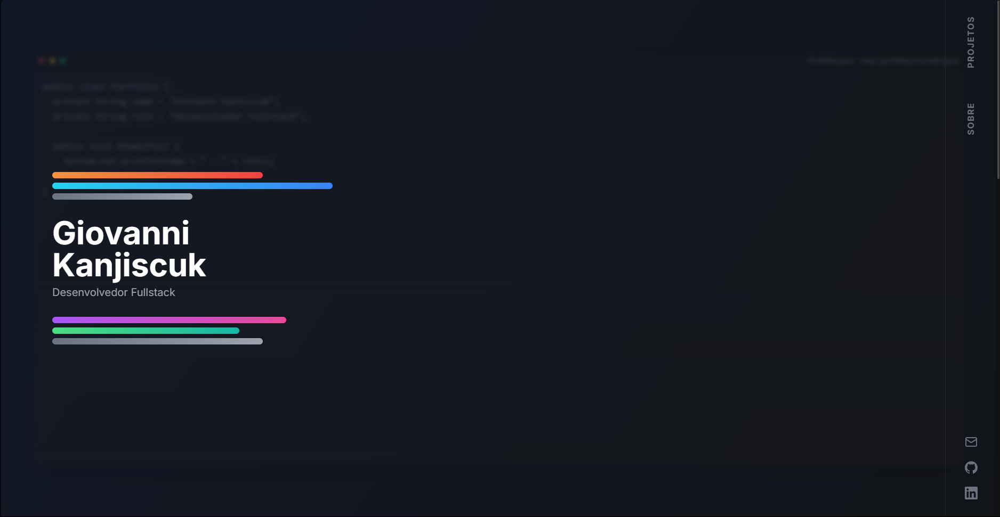

# Portfólio de Giovanni Kanjiscuk

> Um portfólio de desenvolvedor fullstack interativo e moderno, construído com as mais novas tecnologias do ecossistema React para criar uma experiência de usuário fluida e memorável.



### [➡️ Ver Site Ao Vivo](https://giovannikanjiscuk.com) 

---

## 📋 Índice

- [Sobre o Projeto](#-sobre-o-projeto)
- [Tecnologias Utilizadas](#-tecnologias-utilizadas)
- [Principais Features](#-principais-features)
- [Rodando o Projeto Localmente](#-rodando-o-projeto-localmente)
- [Contato](#-contato)

## 💡 Sobre o Projeto

Este projeto foi desenvolvido para ser mais do que apenas um currículo digital; é uma demonstração prática das minhas habilidades em desenvolvimento front-end e da minha atenção aos detalhes de design e experiência do usuário. A estética foi inspirada em portfólios de desenvolvedores criativos de ponta, como os de Guillaume Gouessan e Dennis Snellenberg, buscando um equilíbrio entre o minimalismo e interações dinâmicas e fluidas.

O objetivo era criar uma interface limpa, profissional e que, ao mesmo tempo, tivesse uma personalidade única, refletida em animações, microinterações e um fundo dinâmico que remete ao ambiente de desenvolvimento.

## 🛠️ Tecnologias Utilizadas

Este projeto foi construído utilizando as seguintes tecnologias:

| Tecnologia | Descrição |
| :--- | :--- |
| **React** | Biblioteca principal para a construção da interface de usuário. |
| **Vite** | Ferramenta de build moderna e ultrarrápida para o ambiente de desenvolvimento. |
| **TypeScript** | Superset do JavaScript que adiciona tipagem estática para um código mais robusto. |
| **Tailwind CSS** | Framework CSS utility-first para estilização rápida e responsiva. |
| **Framer Motion** | Biblioteca de animação para React, utilizada para as transições de página e animações de componentes. |
| **GSAP** | (GreenSock Animation Platform) Utilizada para as animações coreografadas do Hero Section. |
| **Lenis** | Biblioteca para a implementação de um efeito de "smooth scroll" suave e performático. |
| **react-icons** | Biblioteca para a inclusão de ícones SVG de alta qualidade. |

## ✨ Principais Features

- **Hero Section Animada:** Uma animação de entrada coreografada com GSAP, inspirada em motion design moderno.
- **Fundo Dinâmico:** Um efeito de fundo sutil que simula uma janela do VS Code com código sendo "digitado", incluindo a simulação de erros e correções, criando uma atmosfera imersiva.
- **Navegação Totalmente Responsiva:** Uma barra lateral fixa para desktop e um menu "hambúrguer" elegante com animação para dispositivos móveis.
- **Scroll Suave:** Navegação fluida entre as seções da página, tanto pelo scroll do mouse quanto pelos cliques nos links da navegação.
- **Microinterações:** Efeitos de hover nos ícones de habilidades (com tooltips) e projetos, que fornecem feedback visual e tornam a experiência mais tátil e agradável.
- **Design Minimalista e Moderno:** Foco em tipografia limpa, espaçamento generoso e uma paleta de cores coesa.

## 🚀 Rodando o Projeto Localmente

Para rodar este projeto no seu ambiente local, siga os passos abaixo:

1.  **Clone o repositório:**
    ```bash
    git clone [https://github.com/](https://github.com/)[SEU-USUARIO]/[NOME-DO-REPOSITORIO].git
    ```

2.  **Navegue para o diretório do projeto:**
    ```bash
    cd Portfolio
    ```

3.  **Instale as dependências:**
    ```bash
    npm install
    ```

4.  **Inicie o servidor de desenvolvimento:**
    ```bash
    npm run dev
    ```

5.  Abra [http://localhost:5173](http://localhost:5173) (ou a porta indicada no seu terminal) no seu navegador.

## 📬 Contato

Gostou do que viu? Vamos conversar!

- **LinkedIn:** [linkedin.com/in/giovanni-kanjiscuk](https://www.linkedin.com/in/giovanni-kanjiscuk)
- **GitHub:** [github.com/GKanjiscuk](https://github.com/GKanjiscuk)
- **Email:** giovannikanjiscuk@gmail.com

---
